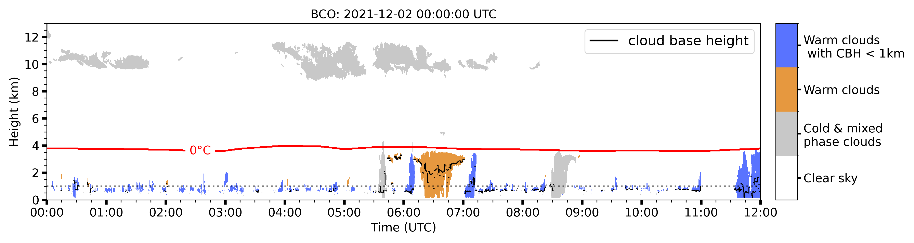

# barbados-clouds

Object based cloud detection and classification for cloud radar measurments over the Barbados Cloud Observatory (BCO).

# Table of Contents
- [Introduction](#introduction)
- [Installation](#installation)
- [Usage](#usage)
- [License](#license)

## Introduction
Connected radar signals are detected as a cloud object. Single objects are classified as warm
clouds, warm clouds with cloud base height below 1km (trade wind clouds) and cold & mixed phase clouds.
The object classification depends on the height location of the cloud object and the accurracy
of the cloud base height information.

Warm clouds are defined as clouds with bases and tops below the height of the 0°C wet-bulb temperature isotherm. 
Trade wind clouds are clouds with a base below 1km (average height of the lifting condensation level over the BCO) and cloud top below the height of the 0°C wet-bulb temperature isotherm. 
Cold and mixed phase clouds are clouds with a cloud top above the height of the 0°C wet-bulb temperature isotherm. 


*02.December 2021 Barbados cloud observatory (BCO): example of classification
of warm clouds and warm clouds with cloud base height (CBH) below 1 km.
Warm clouds are clouds with CBH and cloud top height (CTH) below the altitude 
of the wet-bulb 0°C temperature isotherm. The cloud base height (from Cloudnet) 
is denoted by the black line when detected. The height of the clouds wet-bulb 0°C temperature isotherm
is marked by the red line.*


# Installation
1. The package can be installed via pip:
   ```
    python -m pip install git@github.com:remsens-lim/barbados-clouds.git
   ```
2. Install the package
   ```sh
      python setup.py install
      ```
<p align="right">(<a href="#top">back to top</a>)</p>

## Usage

As input sources the **Cloudnet target classification** and **Cloudnet target categorization** products are mandatory.

1. First, import the `CloudProcessor` class from the `main` module:

   ```python
   from main import CloudProcessor
   
2. Define the file paths for your input, output, and plot data:
   ```python
      input_data = 'PATH_TO_INPUT_DATA'
      output_data = 'PATH_TO_OUTPUT_DATA'
      plot_data = 'PATH_TO_PLOT_DATA'
   ```
3. Create an instance of the CloudProcessor class, 
specifying the input and output paths:
   ```python
   cloud_processor = CloudProcessor(file_path=input_data, dataset_path=output_data, plot_path=plot_data)
   ```
4. Generate the cloud dataset using the create_cloud_dataset method. You can also enable plotting by setting the plot parameter to True:
   ```python
   cloud_processor.create_cloud_dataset(dataset_path=output_data, plot=True)
   ```
<p align="right">(<a href="#top">back to top</a>)</p>

## License
Distributed under the MIT License. See `LICENSE` for more information.

<p align="right">(<a href="#top">back to top</a>)</p>
